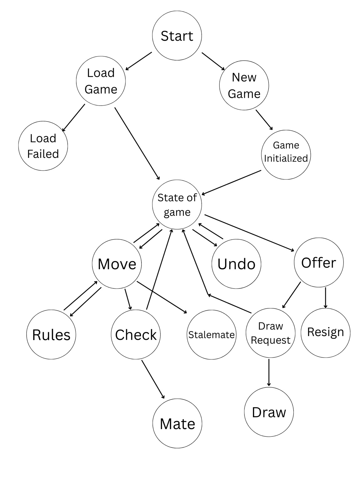

# AFK2 Console Chess

A fully playable, object-oriented chess game implemented in **Java** with a console UI. Play against a friend or (optionally) against Stockfish with multiple difficulty levels. Supports all FIDE chess rules with move validation, timers, PGN saving/loading, and more.

---

## Table of Contents

- [Features](#features)
- [Requirements](#requirements)
- [Installation](#installation)
- [Usage](#usage)
- [Project Structure](#project-structure)
- [How It Works](#how-it-works)
- [Architecture](#architecture)
- [Commands](#commands)
- [Contributing](#contributing)
- [License](#license)

---

## Features

### Core Gameplay
- **Complete FIDE Chess Rules** - All piece movements validated
- **Special Moves** - Castling, en passant, pawn promotion
- **Game Detection** - Check, checkmate, stalemate
- **Move Notation** - Coordinate notation (`e2e4`) and algebraic notation (`Nf3`)
- **Player Timers** - Per-player chess clocks (5-minute default, configurable)
- **Move Undo** - Full game state restoration
- **Beautiful Display** - Unicode chess pieces and formatted board

### Game Management
- **Save & Load** - PGN format support
- **Draw Offers** - Players can offer and accept draws
- **Resignation** - Graceful game ending
- **Move History** - Track all moves in a game

### Bot Integration (Optional)
- **Stockfish Engine** - UCI protocol support
- **Difficulty Levels** - Beginner to Grandmaster
- **Configurable Thinking Time** - Customize AI response speed

### Design Highlights
- **Clean OOP Architecture** - Abstract base classes, single responsibility
- **Modular Rules Engine** - Separate handlers for special moves
- **Board as Single Source of Truth** - No desynchronization
- **Comprehensive Validation** - All inputs checked, illegal moves rejected

---

## Requirements

- **Java** 8 or higher
- **Maven** (optional, for dependency management)
- **Stockfish** (optional, for bot functionality)

### Recommended
- Java 11+
- Terminal with UTF-8 support (for Unicode chess pieces)

---

## Installation

### 1. Clone or Download
```bash
cd /path/to/AFK2-Console-Chess
```

### 2. Compile
```bash
javac -d bin -sourcepath src src/chess/**/*.java
```

Or using Maven (if pom.xml exists):
```bash
mvn clean compile
```

### 3. (Optional) Install Stockfish
For bot functionality, download Stockfish:
- **macOS**: `brew install stockfish`
- **Linux**: `sudo apt-get install stockfish`
- **Windows**: Download from [stockfishchess.org](https://stockfishchess.org)

Ensure `stockfish` is in your system PATH or provide the full path in config.

---

## Usage

### Run the Game
```bash
java -cp bin chess.Main
```

### Main Menu
```
=== Main Menu ===
1. New Game (2 Players)
2. New Game (vs Bot)
3. Load Game from PGN
4. Help
5. Exit

Choice: 1
White player name (default: Player 1): Alice
Black player name (default: Player 2): Bob
```

### Playing a Move
- **Coordinate notation**: `e2e4` or `e2 e4` (from → to)
- **Algebraic notation**: `Nf3`, `Bxc5`, `exd6`

### Example Session
```
   a b c d e f g h
  ┌─────────────────┐
8 │ ♜ ♞ ♝ ♛ ♚ ♝ ♞ ♜ │ 8
7 │ ♟ ♟ ♟ ♟ ♟ ♟ ♟ ♟ │ 7
6 │ · · · · · · · · │ 6
5 │ · · · · · · · · │ 5
4 │ · · · · · · · · │ 4
3 │ · · · · · · · · │ 3
2 │ ♙ ♙ ♙ ♙ ♙ ♙ ♙ ♙ │ 2
1 │ ♖ ♘ ♗ ♕ ♔ ♗ ♘ ♖ │ 1
  └─────────────────┘
   a b c d e f g h

Alice (WHITE) — 4:59
Your move: e2e4
Move: e2 → e4

Bob (BLACK) — 5:00
Your move: c7c5
```

---

## Project Structure

```
AFK2-Console-Chess/
├── src/chess/
│   ├── Main.java                          # Entry point & game loop
│   ├── core/                              # Core game model
│   │   ├── Color.java                     # WHITE/BLACK enum
│   │   ├── Position.java                  # Board square [file, rank]
│   │   ├── Move.java                      # Move with flags & metadata
│   │   ├── Piece.java                     # Abstract piece base class
│   │   ├── Board.java                     # 8×8 board state
│   │   ├── Player.java                    # Player info & settings
│   │   ├── Game.java                      # Game orchestrator
│   │   ├── GameState.java                 # Game state enum
│   │   └── ChessClock.java                # Per-player timers
│   │
│   ├── pieces/                            # Concrete piece classes
│   │   ├── Pawn.java                      # Pawn movement rules
│   │   ├── Rook.java                      # Rook movement rules
│   │   ├── Knight.java                    # Knight movement rules
│   │   ├── Bishop.java                    # Bishop movement rules
│   │   ├── Queen.java                     # Queen movement rules
│   │   └── King.java                      # King movement rules
│   │
│   ├── rules/                             # Move validation & special rules
│   │   ├── MoveValidator.java             # Move legality checking
│   │   ├── CheckDetector.java             # Check/checkmate/stalemate
│   │   ├── CastlingHandler.java           # Castling logic
│   │   ├── EnPassantHandler.java          # En passant tracking
│   │   ├── PromotionHandler.java          # Pawn promotion
│   │   └── UndoManager.java               # Game state snapshots
│   │
│   ├── io/                                # Console I/O
│   │   ├── ConsoleUI.java                 # Board display & prompts
│   │   ├── InputParser.java               # Command & move parsing
│   │   ├── CommandType.java               # Command enumeration
│   │   └── CommandHandler.java            # Command routing
│   │
│   ├── pgn/                               # PGN file support
│   │   ├── PgnGameMetadata.java           # Metadata tags
│   │   ├── PgnMoveRecord.java             # Move pair storage
│   │   ├── PgnParser.java                 # PGN parsing
│   │   ├── PgnWriter.java                 # PGN writing
│   │   └── PgnFormatException.java        # PGN error handling
│   │
│   ├── engine/                            # Game controller & bot
│   │   ├── GameController.java            # High-level API
│   │   ├── ChessEngine.java               # Bot interface
│   │   ├── BotDifficulty.java             # AI difficulty levels
│   │   ├── StockfishEngine.java           # Stockfish integration
│   │   ├── TimeControl.java               # Time management
│   │   ├── FenUtil.java                   # FEN notation utilities
│   │   └── EngineException.java           # Engine error handling
│   │
│   └── util/                              # Utility functions
│       ├── AlgebraicNotationUtil.java     # Notation conversions
│       ├── BoardPrinter.java              # Board formatting
│       └── TimeUtils.java                 # Time formatting
│
├── bin/                                   # Compiled bytecode (after build)
├── example.pgn                            # Sample PGN file
├── TestBotGame.java                       # Bot integration tests
├── pom.xml                                # Maven configuration (optional)
└── README.md                              # This file
```

---

## How It Works

### 1. Game Initialization
- Players enter names and time controls
- Board initialized to standard chess starting position
- Clocks started

### 2. Move Input & Parsing
- Player enters move in **coordinate** or **algebraic** notation
- InputParser validates syntax and detects command type
- Move object constructed with piece, source, destination

### 3. Move Validation Pipeline
```
User Input
    ↓
Parse (coordinate or algebraic)
    ↓
Get pseudo-legal moves from piece
    ↓
Check path clearance (for sliding pieces)
    ↓
Validate capture rules
    ↓
Check if move leaves own king in check
    ↓
Handle special moves (castling, en passant, promotion)
    ↓
Apply to board
    ↓
Update game state (check, checkmate, stalemate)
    ↓
Record in move history
```

### 4. Special Moves
- **Castling**: King moves 2 squares, rook auto-moves
- **En Passant**: Pawn captures diagonally behind opponent's pawn
- **Promotion**: Pawn reaching 8th rank becomes Q/R/B/N

### 5. Game State Detection
- **Check**: King under attack; must move to safety
- **Checkmate**: King in check with no legal moves
- **Stalemate**: Not in check but no legal moves

### 6. Save & Load (PGN)
- All moves recorded in move history
- PgnWriter converts history to PGN format with metadata
- PgnParser reconstructs game by replaying moves

### 7. Undo System
- UndoManager maintains snapshots of board state
- Undo reverts board, timers, draw offers, and move history

### 8. Bot Moves (Optional)
- Game state converted to FEN notation
- Sent to Stockfish via UCI protocol
- Engine returns best move
- GameController applies move to board

---

## Architecture

### Core Principles

#### State Diagram

The diagram below illustrates the main game states and transitions (new game, loading, ongoing play, draw offer, resignation, check, checkmate, stalemate, and undo transitions):



### Core Principles

#### 1. **Board as Single Source of Truth**
```
Board holds all piece positions
    ↓
All queries, validation, and moves go through Board
    ↓
No external state desynchronization
```

#### 2. **Piece Polymorphism**
```
abstract Piece
    ├── Pawn
    ├── Rook
    ├── Knight
    ├── Bishop
    ├── Queen
    └── King

Each implements getLegalDestinations(Board)
```

#### 3. **Separation of Concerns**
```
Game Logic (core, pieces, rules)
    ↓
Game Controller (engine)
    ↓
I/O Layer (ConsoleUI, InputParser)
    ↓
User
```

#### 4. **Move Validation Layers**
```
Level 1: Piece-specific movement (Pawn, Knight, etc.)
    ↓
Level 2: Path clearance & captures
    ↓
Level 3: King safety (no move leaving own king in check)
    ↓
Level 4: Special move handlers (castling, en passant, promotion)
```

#### 5. **Immutable Move Objects**
- Move objects cannot be changed after creation
- Builder pattern for complex moves
- Prevents accidental state corruption

---

## Commands

| Command | Purpose | Example |
|---------|---------|---------|
| `e2e4` or `e2 e4` | Move (coordinate notation) | Move pawn from e2 to e4 |
| `Nf3` | Move (algebraic notation) | Move knight to f3 |
| `Bxc5` | Capture bishop on c5 | |
| `O-O` | King-side castling | |
| `O-O-O` | Queen-side castling | |
| `draw` | Offer a draw | |
| `accept` | Accept draw offer | |
| `resign` | Resign from game | |
| `undo` | Undo last move | Restores board, timers, history |
| `save filename.pgn` | Save game to file | `save game1.pgn` |
| `load filename.pgn` | Load game from file | `load game1.pgn` |
| `help` | Show command help | |
| `exit` | Return to main menu | |

---

## Architecture Decisions

### Why HashMap for Board?
```java
HashMap<Position, Piece> board
```
- O(1) lookup time for piece at position
- Sparse representation (only occupied squares stored)
- Easy king position tracking

### Why Abstract Piece Class?
- Each piece has unique movement rules
- Polymorphism eliminates giant switch statements
- New pieces can be added by extending Piece

### Why Deep Copy for Undo?
- Simple, foolproof implementation
- No need to track individual state changes
- Scales well for games with reasonable move counts

### Why Separate UndoManager?
- Board doesn't know about history
- Undo logic isolated from game logic
- Easy to modify undo behavior independently

---

## Known Limitations

| Issue | Workaround |
|-------|-----------|
| Complex algebraic notation (e.g., `N1d2`) not supported | Use coordinate notation (`g1d2`) |
| PGN replay doesn't validate format strictly | Use valid PGN files from standard sources |
| Stockfish requires manual installation | Optional—play without bot if not installed |
| No network multiplayer | Play locally only |

---

## Testing

The project includes validation for:
- All piece movements (pseudo-legal)
- Move legality (no moving opponent's pieces)
- Path clearance (no pieces blocking slides)
- Capture detection
- King safety (no moves leaving king in check)
- Check, checkmate, stalemate detection
- Castling conditions (king & rook unmoved, unobstructed)
- En passant conditions (specific 2-square pawn move)
- Pawn promotion requirement (reaching rank 8)
- Board boundary validation

### Running Tests
```bash
# Compile
javac -d bin -sourcepath src src/chess/**/*.java

# Run main game
java -cp bin chess.Main

# Or run test
java -cp bin TestBotGame
```

---

## Contributing

### Team Responsibilities

| Team Member | Module | Responsibility |
|-------------|--------|-----------------|
| **Kaloyan** | Core & Pieces | Color, Position, Move, all piece classes, Board, Game state |
| **Filip** | Rules & I/O | Castling, en passant, promotion, undo, ConsoleUI, InputParser |
| **Angi** | PGN & Controller | PgnWriter, PgnParser, GameController, draw/resign logic |
| **Kris** | Engine & Docs | Stockfish engine, BotDifficulty, README, diagrams |

### Code Standards
- No public fields except static constants
- All inputs validated (no null, no empty strings)
- Custom exceptions for domain errors
- Comprehensive JavaDoc on public APIs
- Immutable Move objects

---

## Future Enhancements

### High Priority
- [ ] Full SAN/LAN algebraic notation parsing
- [ ] Move hint system based on piece valuation
- [ ] Opening book support

### Medium Priority
- [ ] Stockfish difficulty balancing
- [ ] Game analysis mode
- [ ] Faster PGN replay with bulk moves

### Low Priority
- [ ] Network multiplayer
- [ ] Online ratings
- [ ] Endgame tablebase support
- [ ] Tournament mode

---

## License

Open source – Educational project

---

## Credits

- **Kaloyan** – Core engine, board, pieces, move validation
- **Filip** – Castling, en passant, promotion, undo, console UI
- **Angi** – PGN support, game controller, draw/resign logic
- **Kris** – Stockfish integration, bot difficulty levels, documentation

---

**Status**: Core game fully functional and ready to play!

